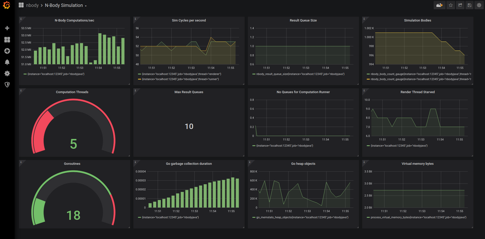

# N-Body Go

This project is a port - in progress - of https://github.com/aceeric/nbodyjava into **Go** from **Java**.

The application is an implementation of the *n-body* physics problem in which a space is filled with a number of bodies (in this case spheres) that each have mass, radius, and velocity. The n-body problem requires that each body accumulate the force of gravitational attraction from each other body continuously in a perpetual loop. (Called the *brute-force* approach.)

This project incorporates code modeled from http://physics.princeton.edu/~fpretori/Nbody/code.htm to implement the gravitational force calculation, and from https://www.plasmaphysics.org.uk/programs/coll3d_cpp.htm to implement the elastic collision calculation. One interesting aspect of the n-body problem from a software perspective is how best to design the simulation to support as many bodies as possible in real time.

Since every body accumulates force from every other body during each computation cycle, the number of computations in each cycle increases significantly with the number of bodies because each cycle requires n * n-1 force calculations:

| Bodies >>                  | 100        | 500         | 1,000         | 2,000         | 5,000          |
| :---------------------------- | ----------: | -----------: | -------------: | -------------: | --------------: |
| Force calculations per cycle | 9,999      | 249,999     | 999,999       | 3,999,999     | 24,999,999     |
| Flops per force calculation  | 30         | 30          | 30            | 30            | 30             |
| Flops per cycle              | 299,970    | 7,499,970   | 29,999,970    | 119,999,970   | 749,999,970    |
| Frames per second            | 50         | 50          | 50            | 50            | 50             |
| Flops per second             | 14,998,500 | 374,998,500 | 1,499,998,500 | 5,999,998,500 | 37,499,998,500 |

Looking at the column for **1,000** bodies: it requires 999 thousand force calculations for one cycle through all the bodies (1000 * 999). Each force calculation is about 30 floating point operations. So that's 29.9 million floating point operations (flops) per cycle. The objective is to render the simulation in real time which requires about 50 frames per second resulting in 1.5 billion floating point operations per second to calculate the gravitational attraction for 1,000 bodies. Going to 2,000 bodies increases flops per second to 6 billion. And so on.

And that doesn't include collision resolution, which requires substantially more floating point operations per collision.

My goal for this project was to build a Golang app that was 100% feature-compatible with the Java version. The Java version is fully documented - you can take a look at the GitHub repo referenced at the top of this README. The Java version used a game engine called JMonkey Engine (https://jmonkeyengine.org/) to render the simulation. I looked around at the options for a Go-based game engine and - short story - settled on something called G3N (http://g3n.rocks/) as the Go rendering engine.

it's safe to say that Go isn't a platform widely used for game development. So it was nice to find a Go-based game engine that supported the set of functionality that I used from JMonkey which - granted - is a limited set of the features offered by both engines.

The Go project design is generally consistent with the Java design: there is a *server* Go app that runs the simulation, opens up a G3N window on the desktop, and displays the running simulation. The reason it is referred to as a server is that the executable contains a gRPC server that listens for messages from a client app. (See https://grpc.io/ for more info about gRPC.)

The *client* Go app allows you to add/modify bodies into a running simulation, and change simulation characteristics like the number of workers, and how collisions are handled, etc.

As in the Java version, I have only tested this under Ubuntu 18.04. I may get around to testing under Windows at some point.

This repo includes the G3N Go code. I made a couple of minor changes to support my needs and it seemed simplest to just include their code - along with the requisite license file. (See `internal/g3n/LICENSE`). I also used code from https://learnopengl.com to implement the fly-by camera. See `cmd/flycam/doc.go` for attribution. In addition, I used the Hashicorp log utils (https://github.com/hashicorp/logutils) for logging equivalence with Apache Log4J, which was used in the Java app.

### Prerequisites

The following steps are required to build and run the application. This README assumes that you've already installed Go. If that's *not* the case, please refer to https://golang.org/doc/install.  This project was developed using Go 1.14, and uses Go *modules*:

```bash
$ go version
go version go1.14.2 linux/amd64
```

This README also assumes the availability of Gnu Make, which seems widely available on Linux. I use the JetBrains GoLand IDE (https://www.jetbrains.com/go/download). If you use that, you will have to manually configure module support since this project's `.gitignore` excludes the IDE config file directory.

First clone the GitHub repository to your local machine:

```bash
$ git clone https://github.com/aceeric/nbodygo.git
$ cd nbodygo
```

The following prerequisites are documented on https://grpc.io/docs/quickstart/go/:

Install gRPC as a Go module:

```bash
$ export GO111MODULE=on
$ go get google.golang.org/grpc@v1.28.1
```

Install the gRPC protobuf compiler. This is the tool that converts the gRPC interface description language into Go code that is referenced by both the client and the server. The protobuf compiler is referenced by the project Make file. On Ubuntu:

```bash
$ sudo apt install protobuf-compiler
```

If that succeeds, then you can execute `which protoc` to get the location of the installed binary, and add it to your PATH.

Install the Go `protoc` plugin and update your PATH as documented on the quick start:

```bash
$ go get github.com/golang/protobuf/protoc-gen-go
$ export PATH="$PATH:$(go env GOPATH)/bin"
```

You have to install some requirements for G3N, as documented on their GitHub repo: https://github.com/g3n/engine:

```bash
$ sudo apt install xorg-dev libgl1-mesa-dev libopenal1 libopenal-dev libvorbis0a libvorbis-dev libvorbisfile3
```

Now, you should be able to build the application (assumes you're in the `nbodygo` directory that you git cloned):

```bash
$ make
```

This should create the client and the server executables in `bin/client` and `bin/server`, respectively:

```bash
$ ls -l bin
total 33116
-rwxr-xr-x 1 eace eace 14495244 Apr 28 15:06 client
-rwxr-xr-x 1 eace eace 19411256 Apr 28 15:06 server
```

Finally, you can run the server with no arguments which runs a default canned sim:

```bash
$ bin/server
```

This should start the simulation window with 1,000 bodies orbiting a sun.  Note that the default resolution is hard-coded as 2560 X 1405. You can change that with the `--resolution` command line option. E.g.: `bin/server --resolution=800x600`

Assuming everything worked and the sim comes up, you can use the standard keyboard navigation keys to navigate the sim: W, A, S, D, etc. See the N-Body *Java* GitHub page for details, and all the command-line options and gRPC client options.

### Java vs Go

TODO some comparisons

### Simulations

The Java version contained a directory `additional/sims` with instructions for running ad-hoc simulations. That directory has been updated and included with this repository in the same location to be compatible with the Go version. The primary difference is using the Go client and server as executables rather than the Java client and server, which compiled to JAR files.

Each file in the directory shows how to run an ad-hoc simulation starting from an empty sim (`bin/server --sim-name=empty`)

### Instrumentation

As with the Java version, the Go version incorporates instrumentation that integrates with Prometheus and Grafana. To run a simulation with instrumentation enabled, you supply an environment variable `NBODYPROM`: meaning *N-body Prometheus*. No value is required, only the existence of the variable is checked:

```bash
NBODYPROM= bin/server --sim-name=sim3 --bodies=1200 --threads=9
```

This activates the built-in Prometheus HTTP service embedded in the simulation and also activate collection and exposition of Prometheus metrics. If you're unfamiliar with these tools, refer to https://prometheus.io/ and https://grafana.com/.

Metrics are exposed on port 12345. With metrics enabled, you can watch them this way: `watch curl -s http://localhost:12345/metrics`. That's  pretty bland. So that's where Grafana comes in: After you run the server as described above, you run another script included in this repository: `additional/scripts/start-containers`.

First you will need to edit a path in that script that matches where you cloned the git repo on your local workstation. When you run this script it starts two Docker containers and mounts the configurations needed by both Prometheus and Grafana to present the metrics exposed by the n-body sim:

```bash
$ additional/scripts/start-containers
$ docker ps
CONTAINER ID  IMAGE            COMMAND                  STATUS         PORTS   NAMES
95b3e7122709  grafana/grafana  "/run.sh"                Up 7 minutes           grafana
7a9cab3d2931  prom/prometheus  "/bin/prometheus --c…"   Up 7 minutes           prometheus
```

After the the sim is running, and the Docker containers are running, view the dashboard at http://localhost:3000. Make sure your browser doesn't have tracking protection, or has disabled cookies etc. Log in as **root/secret** and you should see the n-body dashboard:

 Grafana Dashboard

As you use the gRPC client to interact with the sim you can observe the impact of various client commands on the simulation. When you're done, just stop the Docker containers: ` docker stop grafana prometheus`.

### gRPC client differences

My intent was to keep the gRPC interfaces identical between the Go and Java versions. But I wound up making a couple small changes to the Go version. One particular difference results from how G3N implements light sources. To support that, the Go gRPC client `add-body` command supports an `intensity` property. Also, because Go is more explicit with type checking than Java, I wound up changing some data types in the gRPC interface to reduce the number of explicit type conversions in the code. As a result, you can't use the Go gRPC client with the Java server, or vice versa.

### To Do

The following tasks remain to complete the project:

| Task     | Description                                                  |
| :------- | ------------------------------------------------------------ |
| README   | Add full instructions for running the client and server. (Copy from Java repo?) |
| Tests    | The Java version didn't include unit tests. The Go version should have those added |
| To Do    | There are numerous `todo` comments sprinkled throughout the code that need to be addressed |
| Go docs  | Finalize the go docs                                         |
| Windows? | Assess effort to support Windows                             |

